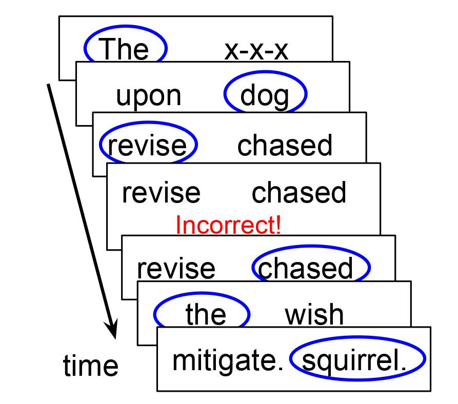

# A-maze

## What is Maze / A-maze?

The **Maze task** is an incremental reading task. Participants read a sentence one word at a time, choosing at each step between two words: the correct next word, and a *distractor* that doesn't fit. The time to choose shows how hard each word was to process. Traditionally the distractors were written by hand ([Forster, Guerrera, & Elliot, 2009](https://www.researchgate.net/profile/Kenneth_Forster/publication/23964016_The_maze_task_Measuring_forced_incremental_sentence_processing_time/links/0c960528e5bae4cf4b000000/The-maze-task-Measuring-forced-incremental-sentence-processing-time.pdf)).

**A-maze** is the Maze task with automatically generated distractors. A language model picks, for each word, a real word that is a poor continuation of the sentence so far. It is described in:

- V. Boyce, R. Futrell, R. P. Levy (2020). [Maze Made Easy: Better and easier measurement of incremental processing difficulty](https://www.sciencedirect.com/science/article/pii/S0749596X19301147). *Journal of Memory and Language*. ([preprint](https://psyarxiv.com/b7nqd/))
- V. Boyce, R. P. Levy (2023). [A-maze of Natural Stories: Comprehension and surprisal in the Maze task](https://escholarship.org/uc/item/6vh9d8zm). *Glossa Psycholinguistics*.

If you use A-maze, please cite these, along with the language model you used. There isn't yet a separate publication for the newer distractor generation (with Hugging Face models). If you use it, please cite one of the A-maze papers (Boyce, Futrell, & Levy, 2020, or Boyce & Levy, 2023), plus the specific language model you used to generate distractors. There's more on the method in [What is A-maze?](intro.md), and a list of [papers using A-maze](papers.md). You can try the task in the [demos](demos.md).

## Current tools

- **[Distractor generation with Hugging Face models](generator.md)** ([maze-distractor-generator](https://github.com/vboyce/maze-distractor-generator)). Uses any Hugging Face causal or masked language model. It has a workflow for reviewing distractors and regenerating bad ones, and a default word list curated to avoid offensive and sensitive words.
- **[Running A-maze in jsPsych](jspsych.md)** ([jspsych-maze](https://github.com/vboyce/jspsych-maze)). A [jsPsych](https://www.jspsych.org/) plugin for the Maze task, with "redo" mode, a delay after mistakes, custom feedback, and styling with CSS.
- **[A-maze for kids](kid-friendly.md)** and **[A-maze in other languages](non-english.md)**.

A typical pipeline: write your materials, then generate distractors with `distract.py --format json`. Review them and regenerate any bad ones. Then load the resulting JavaScript module into a jsPsych experiment that uses the Maze plugin.

## Older tools

These are kept for existing projects but aren't maintained:

- **Original distractor generation**, as described in Boyce et al. (2020) and Boyce & Levy (2023). This is the `maze_automate` code in [vboyce/Maze](https://github.com/vboyce/Maze), which uses the Gulordava et al. (2018) language model by default. See the [install](install.md), [basic use](usage_basic.md), [parameters](parameters.md) and [advanced options](usage_adv.md) pages. If you used it, please also cite the model: K. Gulordava, P. Bojanowski, E. Grave, T. Linzen, M. Baroni (2018). Colorless green recurrent networks dream hierarchically. *NAACL*. For French: A. An, P. Qian, E. Wilcox, R. P. Levy (2019). Representation of Constituents in Neural Language Models: Coordination Phrase as a Case Study. *EMNLP*.
- **[Ibex implementation of Maze](ibex.md)** ([Ibex-with-Maze](https://github.com/vboyce/Ibex-with-Maze)), including [hosting an Ibex server](server.md).

If you run into bugs or issues, feel free to raise issues on GitHub or email me.
