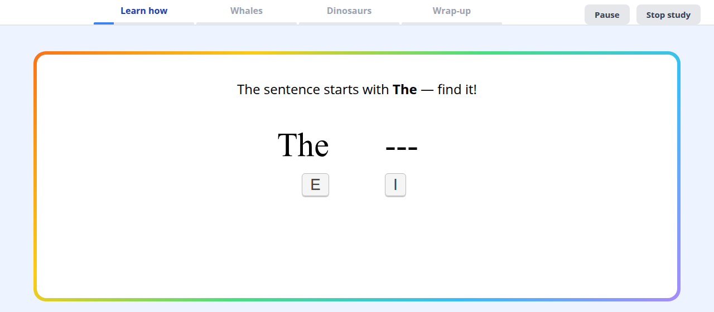
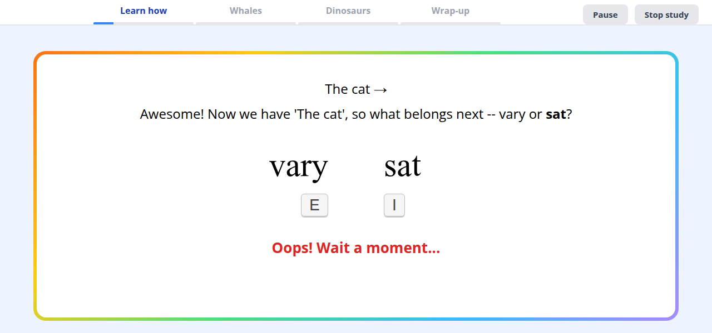

# Maze for kids

The Maze task works with children, but the default look (black words on white, terse feedback) isn't very welcoming. Maze only works if kids understand the task before the real items start. This page shows how the jsPsych plugin can be restyled and scaffolded for children. It uses the [kid-friendly demo](https://vboyce.github.io/maze-demos/kid-maze-experiment/index.html) as the worked example; that demo is based on [kid-maze-passages](https://github.com/vboyce/kid-maze-passages), a study with 8–12 year olds on Children Helping Science.



All the code is in [jspsych-maze](https://github.com/vboyce/jspsych-maze):
- `source/src/kid-maze-experiment.js`: the timeline.
- `source/src/kid/`: practice levels, progress bar, pause/stop.
- `source/styles/kid.scss`: the styling.

## 1. Scope your styles

Put every kid rule under a class you add to `<body>` when the experiment starts:

```js
document.body.classList.add("kid-maze");
```

```scss
body.kid-maze {
  background: #eef4ff;
  h2 { color: #1e40af; }
  // ...every other rule...
}
```

This keeps the styles from leaking into anything else on the page: other experiments built from the same stylesheet, or the host platform's own pages. On Children Helping Science / Lookit, your experiment shares the page with the platform's consent and exit screens. kid-maze-passages adds a `study-active` class only once its own screens start, and its build script prefixes every CSS selector with it.

## 2. A friendly frame

A light background and a rainbow-bordered card around the content. The border is a gradient behind the card, showing through a 6px gap:

```scss
.jspsych-content-wrapper {
  background: linear-gradient(135deg, #f97316, #facc15, #4ade80, #38bdf8, #a78bfa);
  border-radius: 22px;
  padding: 6px;                 // the visible "border"
  max-width: 1160px;
}
.jspsych-content {
  background: #ffffff;
  border-radius: 17px;
  padding: 48px;
}
```

Big rounded buttons (`.jspsych-btn`) and 22px text on instruction slides also help younger readers.

## 3. Show which key is which

`show_key_labels: true` draws key badges under the two words, so kids don't have to remember which key is left:

```js
{ type: MazePlugin, correct: sent, distractor: dist, prompt: "", show_key_labels: true }
```

The badges show the first key of `choice_left` and `choice_right` (E and I by default).

## 4. Gentle, colored feedback

Mistakes are expected, so make the feedback reassuring rather than punishing. Keep a delay (so button-mashing doesn't pay), and use color along with the text:

```js
const ERROR_MESSAGE = "<p class='feedback-error'>Oops! Wait a moment...</p>";
const REDO_MESSAGE  = "<p class='feedback-redo'>Try again!</p>";
```

```scss
#feedback { font-size: 26px; min-height: 140px; }   // min-height stops the layout jumping
.feedback-error { color: #dc2626; font-weight: bold; }
.feedback-redo  { color: #1e40af; font-weight: bold; }
```



## 5. Guided practice with callbacks

The demo's practice has three levels that fade out the help:

1. **Level 1:** a tip for every word, the sentence so far shown above the words, and a fixed left/right `order`. The first distractor is `---`, and the instructions say to always pick the other word.
2. **Level 2:** the sentence builds up above the words, but there are no tips.
3. **Level 3:** no help, like the real passages.

This uses the plugin's `on_word_correct` callback. Whatever HTML it returns replaces the prompt above the words:

```js
mazeItem.on_word_correct = ({ wordIndex, wordsSelected }) => {
  const sentSoFar = wordsSelected.join(" ");
  const tip = sent.word_tips[wordIndex + 1] ?? "";
  return `<p>${sentSoFar} →</p><p>${tip}</p>`;
};
```

`on_word_wrong` works the same way after mistakes: its return value replaces the redo message (e.g. "Try again! Try choosing the other word!").

## 6. Structure and breaks

- **A progress bar** with a section for each part (Learn how / Story 1 / Story 2 / Wrap-up). Each section fills up as sentences are finished, and story sections are labelled by topic.
- **Pause and Stop buttons** in the progress bar. Pause calls `jsPsych.pauseExperiment()` and shows an overlay. Stop jumps to the end: every main trial is wrapped in a nested timeline whose `conditional_function` checks a stop flag, so stopping just skips the rest.
- **Pictures between sentences**, and short topic passages instead of unrelated sentences, keep kids interested. The demo shows an image after some sentences (press space to continue) and a stretch break between passages.
- **Notes for parents** on instruction screens: help find the keys during practice, then let the child respond on their own.

## Data

All of this is presentation only. Every maze trial still records the usual `rt`, `cumrt`, `correct`, `words`, `distractors` and `order` (see [Running Maze in jsPsych](jspsych.md#data)). In kid-maze-passages, passage trials also record `passage` and `sentence` numbers through jsPsych's `data` parameter, which distinguishes practice trials from passage trials.
